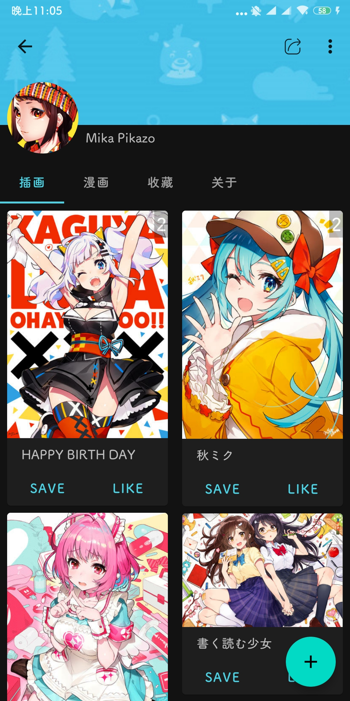
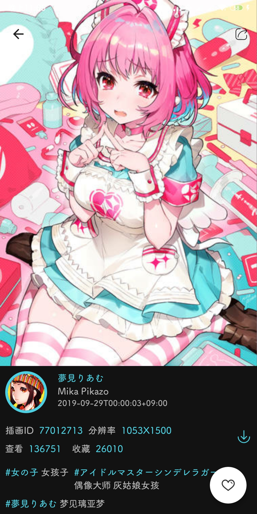

# PixEz 阅读器

  
!!(**deprecated**)停止维护  

转为开发flutter版[新版PixEz](https://github.com/Notsfsssf/pixez-flutter)（与IOS双端同步）  

直连仍然可用，请转到flutter版[PixEz](https://github.com/Notsfsssf/pixez-flutter)

由ultranity继续维护的原生版已经过商议不再维护，全面转到flutter版

一个支持免代理直连及查看动图的第三方 Pixiv Android 客户端。

# 下载

|来源|说明|
|:---:|:---:|
|[Google Play](https://play.google.com/store/apps/details?id=com.perol.asdpl.play.pixivez)|~~**★推荐!** 点这个，从 Google Play 上下载 需要已配置好 Play 全家桶，更新方便~~ 因bugly依赖已下架|
|[GitHub Release](https://github.com/Notsfsssf/Pix-EzViewer/releases)|点这个，在 GitHub Release 页面下载完整 APK 适用于没有 Play / 分享给他人时|

Java 端通过修改 `OkHttp` 的 `SSLSocket` 实现绕过 SNI 审查（即旁路阻断）直连 Pixiv 的功能

- 具体实现 [点此](https://github.com/Notsfsssf/Pix-EzViewer/tree/master/app/src/main/java/com/perol/asdpl/pixivez/networks) 浏览

如果直连代码对你有所启发，在项目或者程序中注明我的 ID 的话，我会很高兴的ヽ✿゜▽゜)ノ

***

如果你正在使用 Muzei 的话，那么由 [@Antony](https://github.com/yellowbluesky) 开发的 [Pixiv for Muzei 3](https://github.com/yellowbluesky/PixivforMuzei3) 是个不错的选择；

如果你需要一个 UWP 客户端，那么由 [@tobiichiamane](https://github.com/tobiichiamane) 开发的 [pixivfs-uwp ](https://github.com/tobiichiamane/pixivfs-uwp)会是不二之选；

如果你需要一个 WPF 客户端，那么可以尝试一下由 [@Rinacm](https://github.com/Rinacm) 开发的 [Pixeval](https://github.com/Rinacm/Pixeval) 。

# Preview
| |  |  |
|:-------------------:|:------------------------:|:-----------------:|

# 交流反馈

对于普通用户，**如果在使用过程中有任何疑问，请先参考我们的 [常见问题](/help/README.md) 页进行快速自查。**

如果你的问题不在上述页面范围内，你可以通过 Email (PxEzFeedBack@outlook.com) 或 [GitHub Issues](https://github.com/Notsfsssf/Pix-EzViewer/issues) 或 下面的聊天群 提交反馈。

如果你是有能 man，且愿意为本项目贡献代码，请不要犹豫提交 Pull Request 吧！

此外，你可以进企鹅群交流经验或者反馈：815791942

也可以在 Telegram 群交流反馈：[@PixEzViewer](https://t.me/PixEzViewer)
